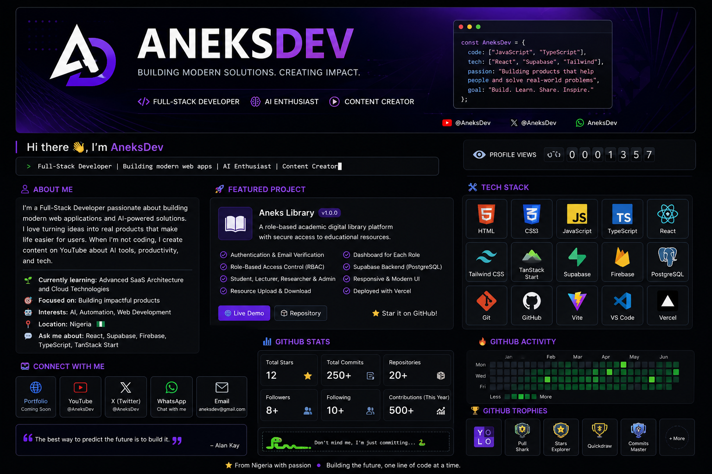

  

<h1 align="center">Hi 👋, I'm AneksDev</h1>

<h3 align="center">
Full-Stack Developer • AI Enthusiast • Content Creator
</h3>

I build modern web applications, AI-powered solutions, and digital products that solve real-world problems.

<a href="https://aneks-library.vercel.app">🌐 Portfolio</a> •
<a href="https://aneks-library.vercel.app">📚 Aneks Library</a> •
<a href="https://www.youtube.com/@AneksDev">📺 YouTube</a> •
<a href="https://x.com/AneksDev">🐦 X</a>

---

# 👨‍💻 About Me

* 🚀 Creator of **Aneks Library**
* 💻 Full-Stack Developer passionate about building scalable web applications.
* 🤖 AI enthusiast exploring automation and intelligent software solutions.
* 🌱 Currently expanding my expertise in SaaS architecture, cloud deployment, and modern web technologies.
* 🎯 My mission is to build software that is useful, reliable, and impactful.

---

# 🚀 Featured Project

## 📚 Aneks Library

A role-based academic digital library designed to provide secure access to educational resources for students, lecturers, researchers, and administrators.

### Key Features

* 🔐 Authentication & Email Verification
* 👥 Role-Based Access Control (RBAC)
* 🎓 Student Dashboard
* 👨‍🏫 Lecturer Dashboard
* 🔬 Researcher Dashboard
* 👑 Admin Dashboard
* 📂 Resource Upload & Download
* ☁️ Supabase Backend
* 📱 Responsive User Interface
* 🚀 Production Deployment

### Live Demo

🌐 https://aneks-library.vercel.app

### Repository

📂 https://github.com/aneksdev-tech/aneks-library

---

# 🛠 Tech Stack

### Frontend

### Backend & Database

### Tools

---

# 📊 GitHub Statistics

---

# 🎯 Currently Working On

* 🚀 Aneks Library v1.1.0
* 🤖 AI-powered web applications
* ☁️ Cloud-native deployment
* 📚 Continuous learning and open-source development

---

# 📫 Connect With Me

* 🌐 Portfolio: https://aneksdev-tech.web.app
* 📚 Aneks Library: https://aneks-library.vercel.app
* 📺 YouTube: https://www.youtube.com/@AneksDev
* 🐦 X: https://x.com/AneksDev
* 📧 Email: [aneksdev@gmail.com](mailto:aneksdev@gmail.com)

---

### ⭐ Thanks for visiting my profile!

*"Code with purpose. Build with passion."*

